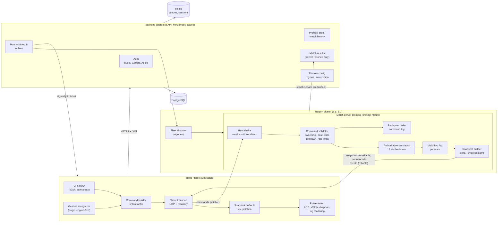

# Architecture

This document is the technical architecture proposal for Conflict Core and the reference for how the codebase is
organised. Decisions with significant trade-offs have their own records in [adr/](adr).

Priorities, in order: **architecture → correct multiplayer simulation → core RTS gameplay → mobile usability →
performance → network robustness → visual quality → content quantity.**

---

## 1. Architecture in one page

* **The server owns reality.** A dedicated match server runs the only authoritative simulation. Clients send
  *intents* (commands); the server validates them against authoritative state, simulates, and sends each client
  a *fog-filtered* view of the world. No client ever decides damage, economy, construction or victory.
* **Deterministic fixed-point simulation.** Gameplay math uses `Fixed` (Q47.16 integers), a PCG32 RNG and
  ordered iteration only. The server is therefore reproducible: a match = initial setup + command log, which
  gives replays, desync-proof re-simulation for disputes/anti-cheat, and golden-value regression tests.
* **Data-driven content.** Units, weapons, armor, veterancy and factions are JSON definitions validated in CI. No
  unit is hard-coded. Client and server compare a content hash at handshake.
* **One language across the stack.** C# everywhere: Unity client, .NET 8 match server, ASP.NET Core backend.
  Simulation, protocol and data code is *the same source* compiled by both Unity and .NET.
* **Engine-free logic, thin engine adapters.** Input recognition, camera math, layout and quality selection live
  in plain C# (`Client/Assets/_Project/Scripts/Logic`, `noEngineReferences: true`) and are unit-tested in CI
  without Unity. MonoBehaviours only translate between Unity and that logic.
* **Centralised, tick-based systems.** No per-unit `Update()`. Simulation runs in fixed ticks (15 Hz) inside
  system managers iterating packed arrays; presentation interpolates at the display rate (30/60 FPS).
* **Disposable match servers.** One process per match, stateless outside that match; persistent data lives in the
  backend/database. Servers are containers scheduled by a fleet manager (Agones) per region.

## 2. Engine choice: Unity 6 LTS + URP

Full record: [adr/0001-engine-unity.md](adr/0001-engine-unity.md).

| Criterion | Unity 6 (URP) | Unreal Engine 5 | Godot 4 |
|---|---|---|---|
| Android/iOS maturity | Excellent, largest share of shipped 3D mobile games | Good, but heavy runtime, large binaries, higher baseline GPU cost | Improving; C# mobile export younger, smaller device coverage |
| Mobile realistic rendering | URP: PBR, cascaded shadows, SRP Batcher, GPU instancing, GPU Resident Drawer, LOD groups, ASTC | Superb high-end, but Lumen/Nanite unavailable on most phones; mobile path needs heavy tuning | Vulkan mobile renderer workable; fewer mobile-scale optimisations |
| Hundreds of RTS entities | Burst + Jobs + Collections, indirect instancing; custom ECS-style managers | Mass Entity, but C++ cost of iteration | GDExtension/C# possible; less tooling |
| Shared code with headless server | C# source shared directly with a plain .NET 8 server | C++ sim shared with dedicated server builds (heavy) | C# possible, ecosystem smaller |
| Profiling | Profiler, Frame Debugger, Memory Profiler, Profile Analyzer, Android GPU Inspector/Xcode integration | Unreal Insights (excellent) | Basic built-in profiler |
| Assets & licensing ecosystem | Asset Store + Fab/Sketchfab/Poly Haven import | Fab, Quixel | Smaller |
| CI/CD | game-ci (Docker), batch mode builds; needs licence secret | Large build machines, long builds | Easy (open source) |

**Decision:** Unity 6 LTS with URP. **Trade-offs accepted:** closed-source engine and licence terms (Unity Pro
required above the revenue threshold), CI needs a licence secret, URP mobile needs disciplined budgets to look
premium. Mitigations: engine-free gameplay core (the simulation does not depend on Unity at all), strict
performance budgets, and an asset pipeline built around LODs and texture budgets.

## 3. Multiplayer model: authoritative server + fog-filtered delta snapshots

Full record: [adr/0002-network-model.md](adr/0002-network-model.md); protocol details: [NETWORKING.md](NETWORKING.md).

Classic PC RTS games use *deterministic lockstep*: every client runs the full simulation and only commands are
exchanged. It was rejected as the primary model because on mobile it means:

* **every client has full world state → map hacks are trivial**, which violates "fog must not leak";
* every phone must run the entire simulation at full rate (CPU/battery), and the slowest device stalls everyone;
* a 2-second network stall freezes the game for all players; reconnect requires fast-forwarding the whole match;
* spectators and join-in-progress need the same full simulation.

Chosen model: **server simulation at 15 Hz; clients send compact commands; the server sends per-player,
visibility-filtered, delta-compressed snapshots; clients interpolate ~2 snapshots behind and render at 30/60 FPS.**
Projectiles and effects are sent as *events* (one message per shot, simulated visually on the client), not as
per-tick transforms. Command acknowledgement feedback (voice line, move marker, turret slewing toward the target)
is immediate and local, which hides command latency the same way PC RTS games always have.

The simulation is nevertheless kept deterministic (fixed-point) because it buys replays, reproducible bug reports,
server-side desync detection, and keeps the door open for client-side prediction of the local player's units.

## 4. Client / server diagram



## 5. Repository structure and module boundaries

```
Shared/                       compiled by Unity AND .NET (C# 9, netstandard2.1, no UnityEngine)
  ConflictCore.Core           Fixed, FixedMath, FixedVector2, DeterministicRandom, EntityId, PlayerSlot, SimTick, StateHasher
  ConflictCore.Protocol       PacketWriter/Reader, ClientHello/HelloReply, CommandBatch/CommandCodec, versioning
  ConflictCore.GameData       definitions, JSON loader (decimal → Fixed), validator, GameDatabase, content hash
  (Phase 2) ConflictCore.Simulation   world state, systems, commands, combat, economy — server-run, client-testable
Server/ConflictCore.Server    host (fixed tick loop), sessions/handshake, (Phase 4) transport, snapshots, validation
Client/Assets/_Project/
  Scripts/Logic               engine-free client logic (gestures, camera model, layout, quality tiers)
  Scripts/Runtime             Unity adapters (input, camera rig, safe area, quality, placeholder terrain, bootstrap)
  Scripts/Editor              project setup and CI build entry points
  Tests/EditMode              Unity-side tests (shared code determinism under Mono/IL2CPP)
Data/                         JSON content and balance
Tools/                        data validator; later: map compiler, benchmark runner, replay inspector
Backend/                      (Phase 9) ASP.NET Core services + SQL migrations
Tests/                        xUnit projects mirroring the modules above
```

Dependency rules (enforced by project references / asmdefs):

```
Core  <-  Protocol
Core  <-  GameData
Core, GameData  <-  Simulation (Phase 2)
Shared/*  <-  Server, Client.Logic, Client.Runtime, Tools
Client.Logic  <-  Client.Runtime  <-  Client.Editor
```

* Shared and Client.Logic never reference UnityEngine; the server never references Unity.
* UI never contains game rules; it reads view models and emits commands.
* No global mutable singletons: dependencies are passed explicitly (server uses `Microsoft.Extensions.Hosting` DI;
  the client uses a composition root in `GameBootstrap`).

## 6. Simulation architecture (Phase 2 design)

* **World** owns component arrays (structure-of-arrays) indexed by dense entity slots; `EntityId`s are
  monotonically allocated and never reused, so stale references are detectable.
* **Systems** run in a fixed, documented order each tick:
  `CommandApply → Orders/AI → Pathing requests → Movement → Targeting → Weapons → Projectiles →
  Damage/Death → Economy/Production/Construction → Visibility (every 3rd tick) → Victory → Snapshot`.
* **Spatial hash grid** (cell ≈ 16 m) for neighbour queries, targeting and splash; rebuilt incrementally.
* **Pathfinding:** grid-based navigation per locomotor class (foot, wheeled, tracked, hover) on the map's
  passability data; hierarchical A* (clusters) for long routes + **flow fields shared by groups** with the same
  destination; formation slots computed once per group command; local avoidance via cheap separation steering;
  path requests are budgeted per tick (time-sliced) and cached.
* **Air units** use separate movement models (helicopter hover/strafe, jet attack runs with turn radius, return to
  airfield to rearm) on an air layer that ignores ground pathing.
* **Weapons** are evaluated per firing unit at tick rate with cooldown counters in ticks; hitscan resolves
  immediately; projectiles/missiles are pooled structs advanced analytically (no physics engine);
  ballistic artillery resolves at a computed impact tick.
* **No floats, no `System.Random`, no unordered iteration, no wall-clock** in simulation code.

## 7. Client presentation architecture

* Snapshot buffer → interpolation (positions, headings, turret yaw) → render proxies. Units are rendered through
  per-archetype instanced batches with LOD selection by screen size; individual GameObjects only for
  selected/hero objects where needed.
* Presentation systems are centralised managers (one `Update` each) that iterate dense arrays: unit visuals, VFX
  pool, audio voice manager, decals, fog texture, selection highlighting.
* Frame budget is enforced by quality tiers and runtime counters (see [PERFORMANCE.md](PERFORMANCE.md)).

## 8. Error handling and logging

* Inbound network data → `ProtocolException` → packet dropped, strike counted; repeated strikes disconnect.
* Data errors are fatal at start-up (server refuses to run with invalid data; CI refuses to merge it).
* Player-facing errors map to specific reasons (`JoinRejectReason`: update required, match ended, ...);
  technical details go to structured logs (server: `ILogger`, source-generated messages; client: log + crash
  reporting in Phase 10).

## Implementation status

| System | Status | Notes |
|---|---|---|
| Repository, build system, conventions, CI | **IMPLEMENTED** | `.editorconfig` style gate, warnings-as-errors, central package versions |
| Deterministic math (`Fixed`, trig, sqrt, RNG, hashing) | **IMPLEMENTED** | golden-value tests guard determinism |
| Protocol serialization, handshake messages, command encoding | **IMPLEMENTED** | fuzz-tested decoder; transport not yet connected |
| Version policy (protocol/client/data hash) | **IMPLEMENTED** | used by `HandshakeHandler` |
| Game data definitions, loader, validator, content hash | **IMPLEMENTED** | strict JSON; CI validation |
| Halcyon unit/weapon data | **PARTIAL** | draft balance; no structures/abilities yet |
| Match server host & fixed tick loop | **PARTIAL** | runs a placeholder simulation; no networking |
| Join ticket verification | **PLANNED** | interface only (`IJoinTicketVerifier`) — Phase 4 |
| Gesture recognition (tap, double tap, long press, pan, box select, pinch/twist) | **IMPLEMENTED** | engine-free, unit-tested; Unity adapter unverified on device |
| RTS camera model (pan, inertia, zoom, rotate, bounds) | **IMPLEMENTED** | engine-free, unit-tested |
| Unity adapters (input router, camera rig, safe area, quality applier) | **PARTIAL** | written against Unity 6 APIs; not yet compiled in this environment — first Unity CI run verifies |
| Quality tiers & device classification | **PARTIAL** | values are initial; needs device profiling |
| Terrain | **PLACEHOLDER** | runtime-generated test terrain, flat colours, visual-only |
| Unity project setup & Android build script | **PARTIAL** | code-driven setup; requires first editor run |
| RTS simulation (movement, pathing, combat, economy) | **PLANNED** | Phase 2–3 |
| Networking transport, snapshots, fog filtering, reconnect | **PLANNED** | Phase 4 |
| Backend, accounts, matchmaking, database | **PLANNED** | Phase 9 (protocol hooks exist: join tickets, resume tokens) |
| Production art, audio, VFX, UI | **PLANNED** | Phase 7 — no production assets in the repository yet |
