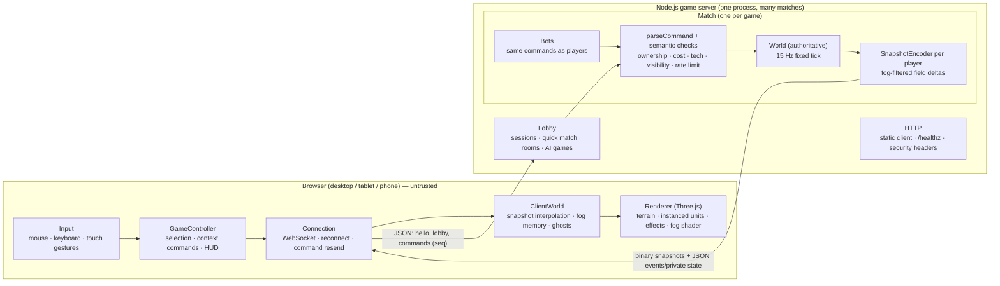

# Architecture

Priorities, in order: **architecture → correct multiplayer simulation → core RTS gameplay → mobile usability →
performance → network robustness → visual quality → content quantity.**

The project started as a Unity/C# design (see ADRs 0001–0004). It was re-platformed to a free, browser-first
TypeScript stack so the game can be played and hosted without licences or paid services (ADR 0005). The
networking model and design priorities carried over unchanged.

## 1. Overview



* **The server owns reality.** Clients send intents (`move`, `attack`, `build`, `produce`, …). The server checks
  shape (`parseCommand`) and meaning (ownership, prerequisites, credits, placement, visibility of targets) against
  its own state. There is no message a client can use to assert an outcome.
* **Fog of war is enforced by omission.** Each player's snapshot contains only entities their team can see;
  combat events are filtered by visibility; private data (credits, queues) only goes to its owner.
* **One shared codebase.** `@conflict/shared` holds game data, map/terrain, the simulation, the AI and the
  protocol. The server runs it authoritatively; the client uses the same terrain, data and placement rules for
  rendering and instant UI feedback; tests and tools reuse it.
* **Data-driven content.** Units, structures, weapons, armor matrix, veterancy and factions are JSON validated
  at load and in CI. No unit is hard-coded in simulation logic.
* **Centralised, tick-based systems.** No per-entity update callbacks: systems iterate entities in a fixed order
  every tick; the client renders through instanced pools and pooled effects.

## 2. Packages and boundaries

```
packages/shared/src
  constants.ts            tick rate, grid sizes, protocol version
  data/                   types, validation, GameData registry (content hash, network indices)
  map/                    MapDef, original maps, analytic Terrain (heights, water, cliffs, passability)
  sim/                    World + systems: orders, movement, navigation (A*), formation, targeting, combat,
                          economy, visibility, victory, placement rules, commands, events, scenarios
  ai/bot.ts               AI opponent (issues normal commands only)
  protocol/               JSON message types + strict parsers, binary snapshot delta codec, event filtering
packages/server/src
  server.ts               HTTP + WebSocket wiring, per-connection rate limit, heartbeat
  lobby.ts                sessions (token-based identity), quick match, rooms, AI matches, dev battles
  match.ts                one authoritative match: fixed-rate loop, command intake, snapshots, reconnects
  staticFiles.ts          safe static serving of the built client
packages/client/src
  net/connection.ts       WebSocket, reconnect with backoff, session token, command sequence + resend
  game/                   ClientWorld (interpolation, fog, ghosts), GameController, placement preview, settings
  input/                  RTS camera, gesture recognizer, input controller (mouse/keys/touch)
  render/                 scene, terrain, environment, models, instanced unit pools, buildings, effects, fog
  ui/                     HUD, minimap, menus/screens, icons, styles
  audio/                  procedural WebAudio sound engine
```

Rules: shared never imports server or client code; the server never imports DOM/Three.js; UI never contains game
rules (it calls the controller, which only sends commands).

## 3. Simulation

* Fixed tick at 15 Hz. Order of systems per tick: apply queued commands → power → orders (targeting, construction,
  harvesting, chasing) → path requests (work-budgeted A*) → movement + separation → combat (turrets, bursts,
  shots) → projectiles → economy (production, regeneration) → visibility (every 2nd tick) → cleanup → victory.
* Navigation: 2 m grid from analytic terrain (water, cliffs, map border) plus structure occupancy; A* with octile
  heuristic, no corner cutting, line-of-sight smoothing; group members reuse a path computed for a neighbour in
  the same tick; per-tick budget counts node expansions (deterministic).
* Combat: weapons from data — hitscan, straight projectiles, guided missiles, ballistic artillery (minimum range,
  scatter, friendly fire); armor × damage multipliers; linear splash falloff; veterancy multipliers.
* Determinism: seeded integer PRNG, insertion-ordered iteration, no wall clock. The same server build reproduces a
  match from its seed and command stream (`World.stateHash()` is checked in tests). See ADR 0005 for why the
  TypeScript version uses floating point instead of fixed point.

## 4. Client

* `ClientWorld` keeps a short sample history per entity and renders 2 ticks behind the latest snapshot, advancing at
  real-time speed with gentle drift correction (smooth under jitter). Events play when render time reaches their
  tick. Enemy structures that leave vision become ghosts until their location is seen again.
* Rendering uses one `InstancedMesh` per unit model part (hull, turret, team markings) — draw calls do not grow
  with unit count. Effects use two particle layers, a tracer line pool and an instanced decal pool.
* Fog of war is applied in every world material through shader injection sampling a small fog texture.

## 5. Implementation status

| System | Status |
|---|---|
| Authoritative server, lobby, quick match, private rooms, AI matches | IMPLEMENTED |
| Reconnect and resync, command dedupe, rate limits, version check | IMPLEMENTED |
| Fog-filtered field-delta snapshots, event filtering | IMPLEMENTED |
| Simulation: movement, pathing, formations, combat, economy, construction, production, power, veterancy, victory | IMPLEMENTED |
| AI (easy / normal / hard) | IMPLEMENTED |
| Browser client: rendering, controls (mouse + touch), HUD, minimap, menus, settings, results, sound | IMPLEMENTED |
| 3D models | IMPLEMENTED as procedural geometry (no downloaded assets; see ASSET_PIPELINE.md) |
| LOD switching for units | PLANNED (instancing keeps cost low today; see PERFORMANCE.md) |
| Aircraft, superweapons, Bastion Union and Sable Front factions, additional maps | PLANNED |
| Replays / spectators | PLANNED (deterministic simulation and command log make this straightforward) |
| Accounts, rankings, match history (database) | PLANNED (BACKEND.md) |
| Legacy C#/Unity prototype in `Client/ Shared/ Server/ Tools/ Tests/` | SUPERSEDED (kept until removal is approved) |
